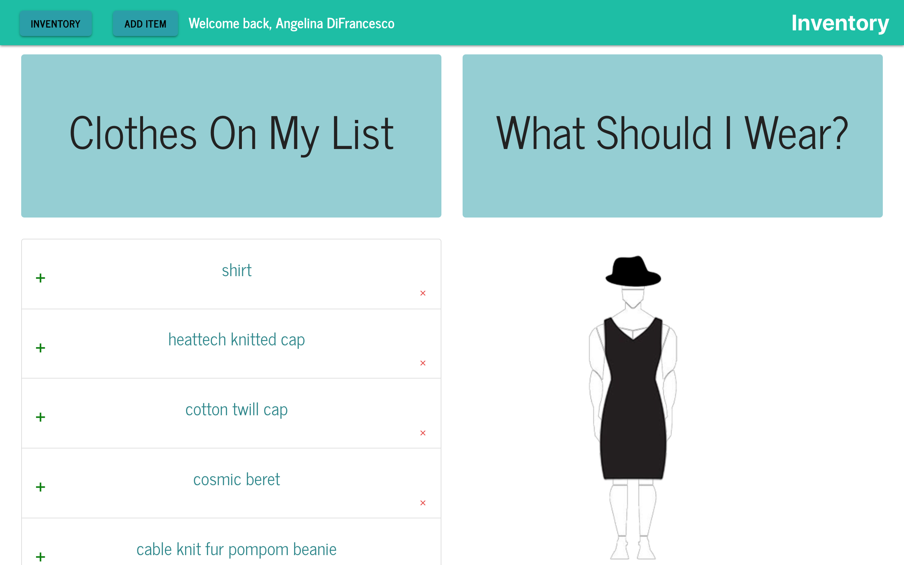
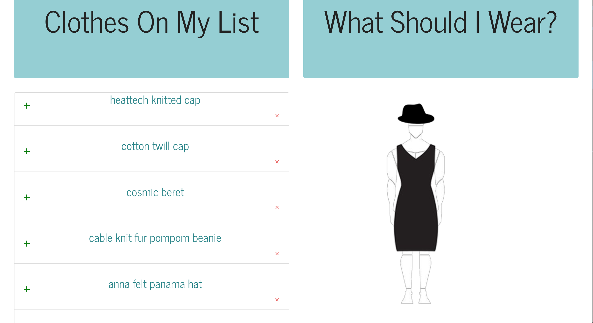
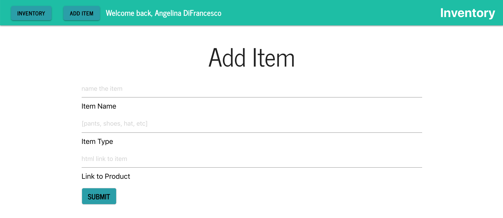

<h1>Inventory</h1>

<h2>What is it?</h2>
A MERN stack application. Inventory allows you to build, save, and share outfits with your friends!
Using Facebook login verification and MongoDB to store items in your closet, our app provides the user with a visual representations of their favorite outfits. Share inspiration with your friends and find your next must-have clothing items of the season.
Online shopping has grown immensely in popularity, but shoppers are left feeling like they are guessing if clothes purchased online will fit as expected. Inventory aims to alleviate this by providing a visual tool to help shoppers figure out what to wear and how to wear it no matter where you are.

<h2>Built With</h2>
<ul>
  <li>React</li>
  <li>Express</li>
  <li>MongoDB</li>
  <li>ES6</li>
  <li>Materialize</li>
  <li>CSS</li>
  <li>Node.js</li>
  <li>Facebook Login</li>
  <li>Photoshop</li>
</ul>

<h2>How does it work?</h2>
When you arrive on the landing page, click Login with Facebook to verify your identify. 
Then, you can view our library of curated on trend items or add items from your own closet.
Once you build your closet, you can build outfits on your avatar.

 

<h2>Future Development Goals</h2>
<ul>
  <li>User profile with saved outfits</li>
  <li>Newsfeed to keep you up to date with your friends' new outfits</li>
  <li>Up and downvote functionality for shared outfits</li>
  <li>Social interaction on Facebook</li>
  <li>Filter inventory by occassion, such as casual vs. professional</li>
  <li>Implement weather API to give you daily outfit recommendations</li>
  <li>Customizable avatars</li>
  <li>Enter your measurements so retailers can recommend your size</li>
 </ul>

<h2>Check us out on Heroku!</h2>
https://inventory3.herokuapp.com/

<h2>Contributors</h2>
<ul>
  <li><a href="https://github.com/carterbaldwin">Carter Baldwin</li>
  <li><a href="https://github.com/Jdelorim">Joshua deLorimier</li>
  <li><a href="https://github.com/linalockheart">Angelina DiFrancesco</li>
</ul>
